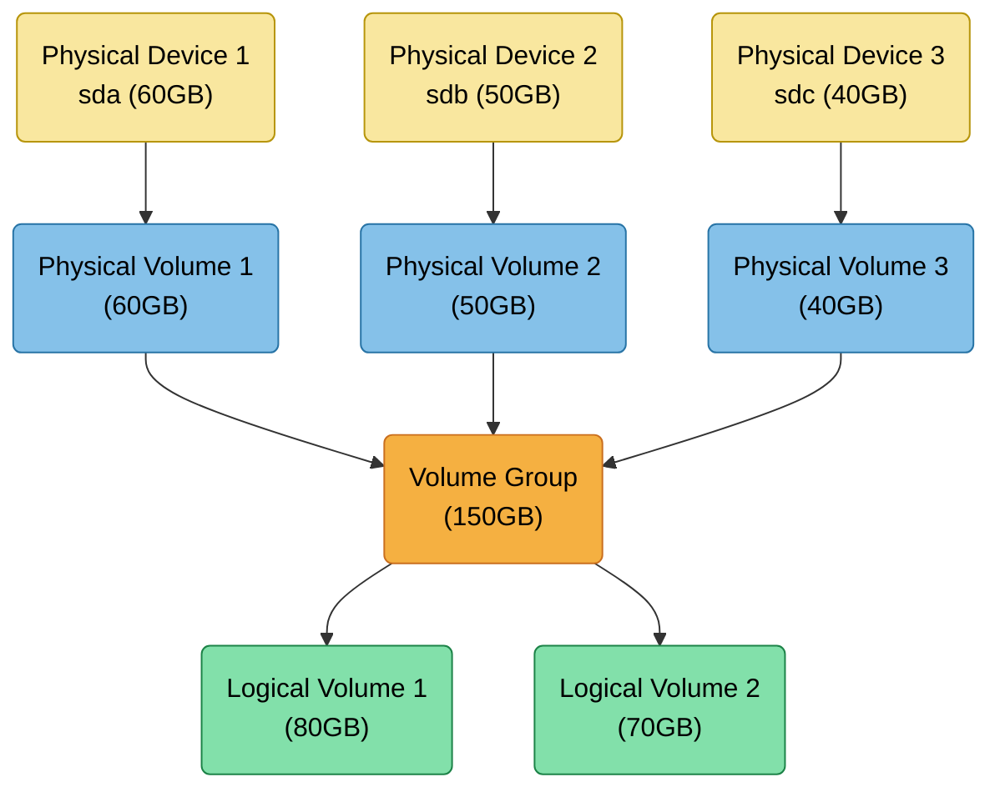

LVM (Logical Volume Manager) provides a flexible, abstraction-based storage layer on Linux. Instead of partitioning disks directly, LVM lets you pool storage from multiple devices and allocate space dynamically.

This improves scalability, snapshotting, resizing, and overall storage management.

## LVM Architecture Overview

<Info>
  LVM provides three layers of abstraction: Physical Volumes (PV), Volume Groups (VG), and Logical Volumes (LV).
</Info>

### Physical Volume (PV)

<Card title="Physical Volume" icon="hard-drive" color="#85c1e9">
  A Physical Volume is a disk or partition prepared for use by LVM. It represents the lowest LVM layer, created from real storage devices (e.g., `/dev/sda`, RAID LUNs).
</Card>

**Key points:**
- Created with `pvcreate`
- Forms the building blocks of a VG
- Can be added or removed to adjust total capacity

```sh
# Create a physical volume
pvcreate /dev/sdb

# List physical volumes
pvs
pvdisplay
```

### Volume Group (VG)

<Card title="Volume Group" icon="object-group" color="#f5b041">
  A Volume Group aggregates one or more PVs into a single storage pool. This pool behaves like one large virtual disk.
</Card>

**Key points:**
- Created with `vgcreate`
- Expands by adding more PVs
- Space is allocated to LVs from the VG

```sh
# Create a volume group
vgcreate my_vg /dev/sdb /dev/sdc

# Extend a volume group
vgextend my_vg /dev/sdd

# List volume groups
vgs
vgdisplay
```

### Logical Volume (LV)

<Card title="Logical Volume" icon="cube" color="#82e0aa">
  A Logical Volume is carved out of a Volume Group and behaves like a virtual partition. Filesystems, swap, containers, or VMs are placed on LVs.
</Card>

**Key points:**
- Created with `lvcreate`
- Can be resized dynamically
- Supports snapshots and thin provisioning

```sh
# Create a logical volume
lvcreate -L 50G -n my_lv my_vg

# Extend a logical volume
lvextend -L +20G /dev/my_vg/my_lv

# List logical volumes
lvs
lvdisplay
```

## LVM Architecture Diagram

The following diagram illustrates how physical devices flow through LVM layers:



<Accordion title="Diagram Legend">
  - 🟨 **Physical Device (PD)** — Actual disk hardware
  - 🟦 **Physical Volume (PV)** — LVM-initialized disk
  - 🟧 **Volume Group (VG)** — Storage pool
  - 🟩 **Logical Volume (LV)** — Virtual partition
</Accordion>

## Common LVM Operations

### Creating a Complete LVM Setup

<Steps>
  <Step title="Create Physical Volumes">
    Initialize disks for LVM use
    ```sh
    pvcreate /dev/sdb /dev/sdc /dev/sdd
    ```
  </Step>
  <Step title="Create Volume Group">
    Pool physical volumes together
    ```sh
    vgcreate data_vg /dev/sdb /dev/sdc /dev/sdd
    ```
  </Step>
  <Step title="Create Logical Volumes">
    Allocate space from the volume group
    ```sh
    lvcreate -L 100G -n database_lv data_vg
    lvcreate -L 50G -n logs_lv data_vg
    ```
  </Step>
  <Step title="Create Filesystems">
    Format and mount the logical volumes
    ```sh
    mkfs.xfs /dev/data_vg/database_lv
    mkfs.xfs /dev/data_vg/logs_lv
    mount /dev/data_vg/database_lv /var/lib/mysql
    mount /dev/data_vg/logs_lv /var/log
    ```
  </Step>
</Steps>

### Resizing Logical Volumes

<Tip>
  LVM allows **online resizing** — you can grow volumes while they're mounted and in use. See [Online Storage Resize](/best-practices/linux/storage/online-resize) for details.
</Tip>

```sh
# Extend logical volume
lvextend -L +50G /dev/data_vg/database_lv

# Grow filesystem (XFS)
xfs_growfs /var/lib/mysql

# Grow filesystem (ext4)
resize2fs /dev/data_vg/database_lv
```

### LVM Snapshots

Create point-in-time snapshots for backups or testing:

```sh
# Create snapshot
lvcreate -L 10G -s -n database_snap /dev/data_vg/database_lv

# Mount snapshot for backup
mount -o ro /dev/data_vg/database_snap /mnt/backup

# Remove snapshot after backup
umount /mnt/backup
lvremove /dev/data_vg/database_snap
```

<Warning>
  Snapshots consume space from the volume group as changes occur. Monitor snapshot usage to prevent them from filling up.
</Warning>

## Troubleshooting

### Visualize the Storage Stack

Use `lsblk` to see the complete storage hierarchy:

```sh
lsblk -e7 -o NAME,HCTL,SIZE,TYPE,FSTYPE,MOUNTPOINT
```

This shows:

```text
FC path (sdX)
    ↓
multipath device (mpathX)
    ↓
LVM logical volume (LV)
    ↓
filesystem (ext4/xfs)
    ↓
mountpoint (/mnt/mpathX)
```

### Common Issues

<Accordion title="Volume Group Not Found">
  ```sh
  # Scan for volume groups
  vgscan
  
  # Activate volume group
  vgchange -ay my_vg
  ```
</Accordion>

<Accordion title="Check Volume Group Free Space">
  ```sh
  # Summary view
  vgs
  
  # Detailed view
  vgdisplay my_vg
  ```
</Accordion>

<Accordion title="Repair LVM Metadata">
  ```sh
  # Backup metadata
  vgcfgbackup my_vg
  
  # Restore if needed
  vgcfgrestore my_vg
  ```
</Accordion>

## Best Practices

<CardGroup cols={2}>
  <Card title="Use Descriptive Names" icon="tag">
    Name VGs and LVs based on their purpose (e.g., `data_vg`, `database_lv`)
  </Card>
  <Card title="Leave Space Free" icon="chart-pie">
    Keep 10-20% of VG space unallocated for snapshots and growth
  </Card>
  <Card title="Monitor Usage" icon="gauge-high">
    Regularly check `vgs` and `lvs` output for capacity planning
  </Card>
  <Card title="Backup Metadata" icon="floppy-disk">
    Periodically run `vgcfgbackup` to save LVM configuration
  </Card>
  <Card title="Use XFS for Large Volumes" icon="database">
    XFS performs better than ext4 for large filesystems
  </Card>
  <Card title="Document Your Layout" icon="file-lines">
    Keep records of PV→VG→LV mappings and purposes
  </Card>
</CardGroup>

## Quick Reference

| Task | Command |
|------|----------|
| **List PVs** | `pvs`, `pvdisplay` |
| **List VGs** | `vgs`, `vgdisplay` |
| **List LVs** | `lvs`, `lvdisplay` |
| **Create PV** | `pvcreate /dev/sdX` |
| **Create VG** | `vgcreate my_vg /dev/sdX` |
| **Create LV** | `lvcreate -L 50G -n my_lv my_vg` |
| **Extend VG** | `vgextend my_vg /dev/sdY` |
| **Extend LV** | `lvextend -L +20G /dev/my_vg/my_lv` |
| **Remove LV** | `lvremove /dev/my_vg/my_lv` |
| **Remove VG** | `vgremove my_vg` |
| **Remove PV** | `pvremove /dev/sdX` |

<Tip>
  For SAN storage environments, combine LVM with multipath for redundancy. See [Online Storage Resize](/best-practices/linux/storage/online-resize) for production expansion procedures.
</Tip>
