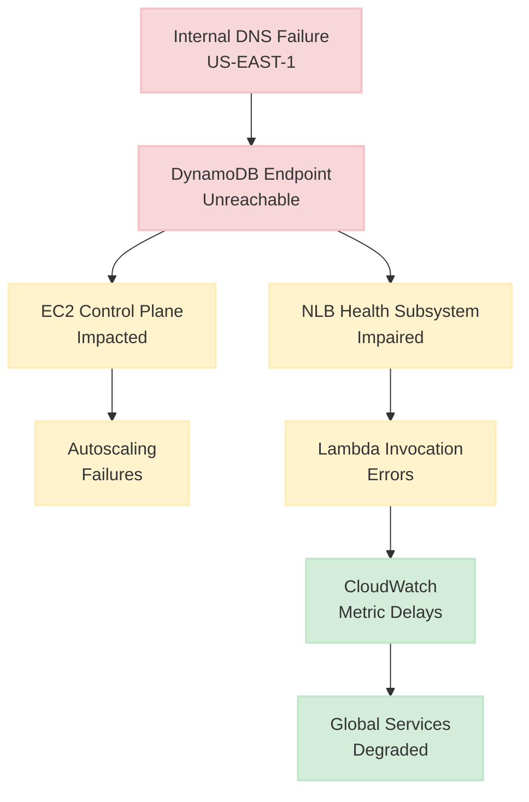
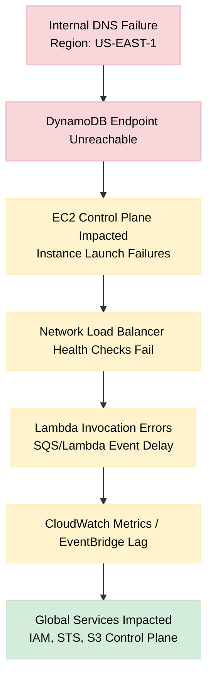
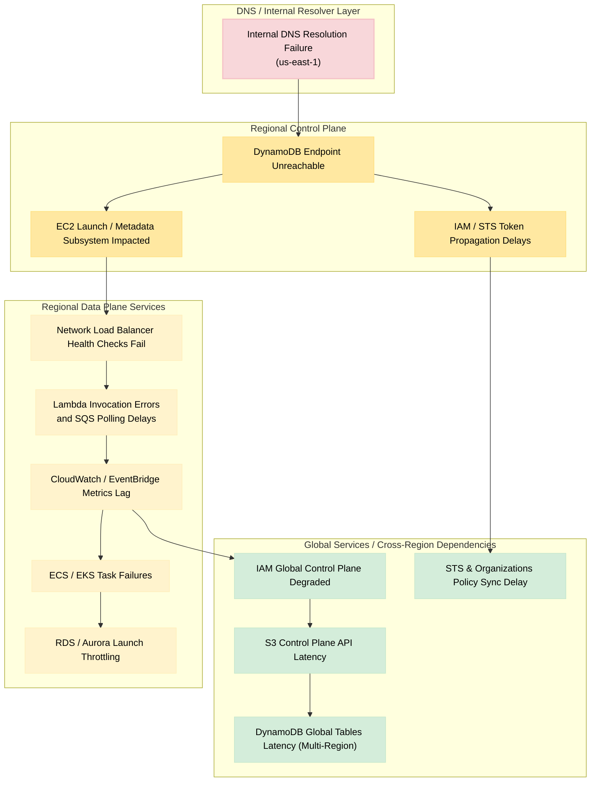

# AWS US-EAST-1 Regional Control Plane Outage

<Info>
**Incident Date:** October 19-20, 2025  
**Duration:** ~15 hours 12 minutes  
**Root Cause:** DNS resolution failure for DynamoDB endpoints  
**Services Affected:** 142 AWS services globally
</Info>

## Overview

Between **October 19, 2025 at 23:49 PDT** and **October 20, 2025 at 15:01 PDT**, AWS experienced a major regional outage in **US-EAST-1 (N. Virginia)**, resulting in elevated error rates and latencies across 142 services worldwide.

<Warning>
The outage demonstrated that many AWS "global" services still rely on US-EAST-1 control APIs, creating a hidden single point of dependency that affected customers globally, including major SaaS platforms like Snapchat, Roblox, Zoom, Lloyds Bank, and HMRC.
</Warning>

The root cause was a **DNS resolution failure** for `dynamodb.us-east-1.amazonaws.com`, which cascaded into the **EC2 control plane** and **Network Load Balancer health subsystems**, affecting dependent services globally.

AWS confirmed full recovery by 15:01 PDT, with residual backlogs cleared over subsequent hours.

## Root Cause Analysis

<Steps>
  <Step title="DNS Resolution Failure">
    Internal DNS systems in US-EAST-1 failed to resolve `dynamodb.us-east-1.amazonaws.com`, making the DynamoDB control plane unreachable.
  </Step>
  
  <Step title="EC2 Control Plane Impact">
    EC2's internal control subsystems relied on DynamoDB tables for instance-launch metadata. Failed DNS lookups caused **instance launch throttling** and **autoscaling failures**.
  </Step>
  
  <Step title="NLB Health Check Failures">
    Network Load Balancer health check subsystems became impaired, breaking Lambda invocation paths and CloudWatch connectivity.
  </Step>
  
  <Step title="Global Service Degradation">
    Global services (IAM, STS, S3 control plane) experienced degraded API operations due to their architectural dependencies on US-EAST-1 control plane operations.
  </Step>
</Steps>

### Primary Trigger

- **DNS resolution failure** for `dynamodb.us-east-1.amazonaws.com`
- DynamoDB API endpoints became unreachable within the region
- No redundancy in DNS resolution for critical control plane services

### Cascading Impact

<Accordion title="Compute Layer (EC2, ECS, EKS)">
  - Instance launches failed or were severely throttled
  - Autoscaling groups couldn't provision new capacity
  - Container orchestration platforms couldn't schedule new tasks
  - Existing workloads continued running but couldn't scale
</Accordion>

<Accordion title="Serverless Layer (Lambda, SQS)">
  - Lambda invocation errors due to NLB health check failures
  - SQS event processing delays
  - Step Functions executions stalled
  - API Gateway intermittent failures
</Accordion>

<Accordion title="Storage Layer (DynamoDB, RDS, S3)">
  - DynamoDB API calls returning errors
  - RDS instance launches throttled
  - S3 control plane operations degraded (bucket creation, policy updates)
  - Data plane operations generally continued
</Accordion>

<Accordion title="Networking Layer (NLB, VPC)">
  - Network Load Balancer health checks failed
  - Transient connectivity losses
  - VPC endpoint provisioning blocked
  - Route 53 private hosted zones impacted
</Accordion>

<Accordion title="Observability Layer (CloudWatch, EventBridge)">
  - Metric ingestion delays
  - Event backlog accumulation
  - Alarm evaluation delays
  - Log ingestion latency
</Accordion>

<Accordion title="Identity Layer (IAM, STS, Organizations)">
  - Temporary credential propagation delays
  - Some authentication requests failed
  - Policy updates not propagating
  - Cross-account role assumptions intermittent
</Accordion>

## Timeline

<Note>
All times are in PDT (UTC-7)
</Note>

| Time | Event Summary |
|:-----|:--------------|
| **Oct 19, 23:49** | Start of increased error rates for multiple AWS services in US-EAST-1 |
| **Oct 20, 00:26** | AWS identified DNS resolution failures for DynamoDB endpoints |
| **Oct 20, 02:24** | DNS issue resolved; early signs of recovery observed |
| **Oct 20, 03:35** | Most services functional; EC2 instance launches still throttled |
| **Oct 20, 08:43** | Identified impaired internal NLB health subsystem; mitigation in progress |
| **Oct 20, 09:38** | NLB health checks restored; connectivity recovery begins |
| **Oct 20, 10:00-15:00** | Gradual unthrottling of EC2, Lambda, and SQS operations |
| **Oct 20, 15:01** | All AWS services confirmed fully operational; minor backlogs remain |

<Tip>
Notice the **6+ hour recovery period** after the initial DNS fix. This highlights how cascading failures create complex recovery scenarios requiring careful, phased restoration.
</Tip>

## Impact Assessment

### Scope

- **Primary Region:** US-EAST-1 (N. Virginia)
- **Duration:** ~15 hours 12 minutes
- **Services Affected:** 142 AWS services
- **Global Impact:** Yes (via global service dependencies)

### Severity by Service Category

| Service Category | Impact Level | Details |
|:----------------|:-------------|:--------|
| **Compute** | 🔴 Critical | Instance launches failed/throttled; autoscaling impaired |
| **Serverless** | 🔴 Critical | Invocation errors; delayed SQS event processing |
| **Storage** | 🟡 High | DynamoDB API failures; S3 control plane degraded |
| **Networking** | 🔴 Critical | Health checks failed; transient connectivity loss |
| **Monitoring** | 🟡 High | Metric delays and event backlog |
| **Identity** | 🟡 High | Temporary propagation delays; some auth failures |

### External Organizations Impacted

<CardGroup cols={2}>
  <Card title="Consumer Apps" icon="mobile">
    - Snapchat
    - Roblox
    - Various mobile games
  </Card>
  
  <Card title="Business Services" icon="briefcase">
    - Zoom video conferencing
    - Numerous SaaS platforms
    - B2B API services
  </Card>
  
  <Card title="Financial Services" icon="bank">
    - Lloyds Bank (UK)
    - Various fintech platforms
    - Payment processors
  </Card>
  
  <Card title="Government" icon="building-columns">
    - HMRC (UK tax authority)
    - Various gov.uk services
    - Public sector applications
  </Card>
</CardGroup>

## Contributing Factors

### Single-Region Control Plane Dependency

<Warning>
Many AWS global services anchor their control plane operations in US-EAST-1. This architectural decision creates a logical single point of failure for worldwide operations.
</Warning>

Services affected by this pattern:
- IAM (Identity and Access Management)
- STS (Security Token Service)
- Organizations
- S3 control plane
- DynamoDB Global Tables metadata

### Tight Service Coupling



### Hidden DNS Dependency

The internal DNS layer was not isolated per-service, creating a shared dependency that amplified cross-impact:
- Single DNS infrastructure serving all services
- No circuit breakers for DNS failures
- Services assumed DNS was always available
- No graceful degradation for DNS lookup failures

### Assumed Control Plane Availability

<Note>
Both AWS engineers and customers operated under the assumption that control plane APIs were always reachable. This incident proved that assumption false and highlighted the need for architectures that don't require control plane access during recovery.
</Note>

## Architecture Diagrams

### Simplified Impact Flow



<Accordion title="Diagram Legend">
  | Color | Meaning |
  |:------|:--------|
  | 🔴 Red/Pink | Root cause (DNS failure) |
  | 🟡 Yellow | Regional impact (service degradation) |
  | 🟢 Green | Global ripple effects (IAM, STS, S3) |
</Accordion>

### Full Impact - Fault Isolation View



### Layered Impact Interpretation

| Layer | Summary | Key Insight |
|:------|:--------|:------------|
| **DNS / Resolver** | Root cause – internal DNS failure in `us-east-1` | Even internal AWS DNS failures can cripple region-wide operations |
| **Regional Control Plane** | DynamoDB, EC2 launch systems, IAM token propagation impacted | Inter-service dependency on DynamoDB for control metadata |
| **Regional Data Plane** | NLB, Lambda, CloudWatch, ECS/EKS, RDS throttling or lag | Control plane degradation causes autoscaling and observability failures |
| **Global Services** | IAM, STS, S3, DynamoDB Global Tables affected globally | "Global" services still rely on US-EAST-1 control APIs |

## Lessons Learned

### For DevOps Teams

<Steps>
  <Step title="Separate Control and Data Planes">
    Avoid architectures that require control-plane API calls during recovery or scaling. Pre-provision resources before they're needed.
    
    **Action Items:**
    - Pre-create load balancers, buckets, and IAM roles
    - Use infrastructure as code to version resource definitions
    - Maintain "warm" standby resources in failover regions
  </Step>
  
  <Step title="Adopt Multi-Region Redundancy">
    Treat US-EAST-1 as a dependency risk, not a default region. Design for active-active or active-passive multi-region deployments.
    
    **Action Items:**
    - Deploy critical workloads across multiple regions
    - Use Route 53 health checks for automatic failover
    - Test regional failover procedures quarterly
  </Step>
  
  <Step title="Use Regional Endpoints">
    Prefer regional STS endpoints over the global endpoint to avoid `us-east-1` reliance.
    
    **Example:**
    ```sh
    # Bad: Uses us-east-1 by default
    aws sts assume-role --endpoint-url https://sts.amazonaws.com
    
    # Good: Uses regional endpoint
    aws sts assume-role --endpoint-url https://sts.eu-west-1.amazonaws.com
    ```
  </Step>
  
  <Step title="Test Control Plane Unavailability">
    Simulate "cannot create resources" scenarios in DR drills. Verify your application can survive without calling AWS APIs.
    
    **Chaos Engineering Tests:**
    - Block all AWS API calls at the network level
    - Test application behavior when autoscaling fails
    - Verify manual recovery procedures work
  </Step>
</Steps>

### For DevSecOps Teams

<Accordion title="Document Fault Isolation Boundaries">
  Understand and document which services have true regional isolation vs. hidden dependencies on US-EAST-1.
  
  **Resources:**
  - [AWS Fault Isolation Boundaries Whitepaper](https://docs.aws.amazon.com/whitepapers/latest/aws-fault-isolation-boundaries/global-services.html)
  - Create internal documentation mapping your critical paths
  - Review AWS service quotas and limits across all regions
</Accordion>

<Accordion title="Implement Graceful Degradation">
  Design services to operate in reduced-functionality mode when control plane APIs are unavailable.
  
  **Patterns:**
  - Cache IAM policy decisions locally
  - Use long-lived credentials for emergency access
  - Implement circuit breakers for AWS API calls
  - Maintain local copies of critical configuration
</Accordion>

<Accordion title="Improve Observability">
  Correlate CloudWatch and SNS events to detect multi-service failures early.
  
  **Implementation:**
  ```python
  # Monitor for correlated service failures
  def detect_regional_outage(events):
      failing_services = [e for e in events if e['status'] == 'degraded']
      if len(failing_services) > 5:  # Multiple services down
          alert('Possible regional outage detected')
  ```
</Accordion>

### For SRE Teams

<Tabs>
  <Tab title="Architecture">
    **Pre-Provision Failover Resources**
    
    Resources should already exist before an outage:
    - DNS records and hosted zones
    - S3 buckets for static content
    - Load balancers in multiple regions
    - IAM roles with trust relationships
    - VPC endpoints for critical services
    
    <Warning>
    Don't rely on the AWS control plane to be available when you need it most.
    </Warning>
  </Tab>
  
  <Tab title="Monitoring">
    **Monitor Control Plane Health**
    
    Track API success rates for control plane operations:
    ```python
    # CloudWatch metric filter
    control_plane_apis = [
        'ec2:RunInstances',
        'dynamodb:CreateTable',
        'iam:CreateRole',
        's3:CreateBucket'
    ]
    
    for api in control_plane_apis:
        cloudwatch.put_metric_data(
            Namespace='ControlPlaneHealth',
            MetricData=[{
                'MetricName': f'{api}_SuccessRate',
                'Value': success_rate,
                'Unit': 'Percent'
            }]
        )
    ```
  </Tab>
  
  <Tab title="Runbooks">
    **Prepare Outage Runbooks**
    
    Document procedures for US-EAST-1 outages:
    1. Detect multi-service degradation
    2. Notify stakeholders
    3. Redirect traffic to alternate regions
    4. Disable autoscaling to prevent API failures
    5. Monitor AWS Health Dashboard
    6. Communicate status to customers
    7. Plan recovery testing after restoration
  </Tab>
</Tabs>

## Key Takeaways

<CardGroup cols={2}>
  <Card title="Control Plane Risk" icon="triangle-exclamation">
    AWS control plane APIs are not always available. Design for this reality.
  </Card>
  
  <Card title="US-EAST-1 Dependency" icon="location-dot">
    Many "global" services actually depend on US-EAST-1. This is a known architecture constraint.
  </Card>
  
  <Card title="Multi-Region Required" icon="earth-americas">
    Single-region deployments are inherently fragile. Multi-region is not optional for critical workloads.
  </Card>
  
  <Card title="Pre-Provision Resources" icon="boxes-stacked">
    Create failover infrastructure before you need it. Recovery is not the time to provision new resources.
  </Card>
</CardGroup>

---

## References

- [AWS Health Dashboard - US-EAST-1 Incident](https://health.aws.amazon.com/health/status)
- [AWS Fault Isolation Boundaries Whitepaper](https://docs.aws.amazon.com/whitepapers/latest/aws-fault-isolation-boundaries/global-services.html)
- [BBC News Coverage](https://www.bbc.co.uk/news/live/c5y8k7k6v1rt)
- [Official AWS Event ARN](https://health.aws.amazon.com/health/status?eventID=arn:aws:health:us-east-1::event/MULTIPLE_SERVICES/AWS_MULTIPLE_SERVICES_OPERATIONAL_ISSUE/AWS_MULTIPLE_SERVICES_OPERATIONAL_ISSUE_BA540_514A652BE1A)

<Note>
**Disclaimer:** This case study is for educational and analytical purposes. All information is based on publicly available sources and official Amazon communications.

**Author:** Zepher Ashe  
**License:** CC BY-NC-SA 4.0  
**Last Updated:** November 21, 2025
</Note>