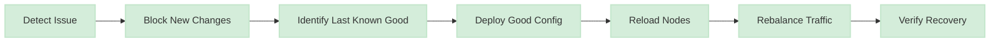
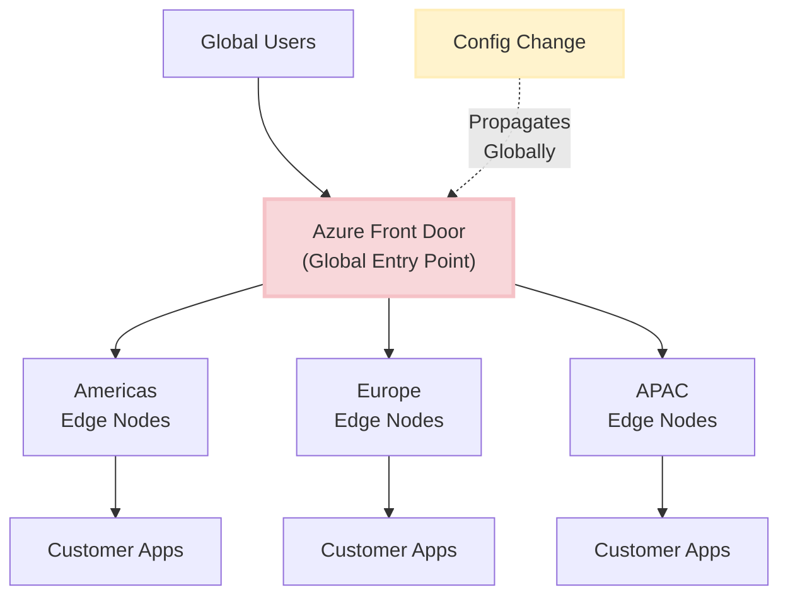
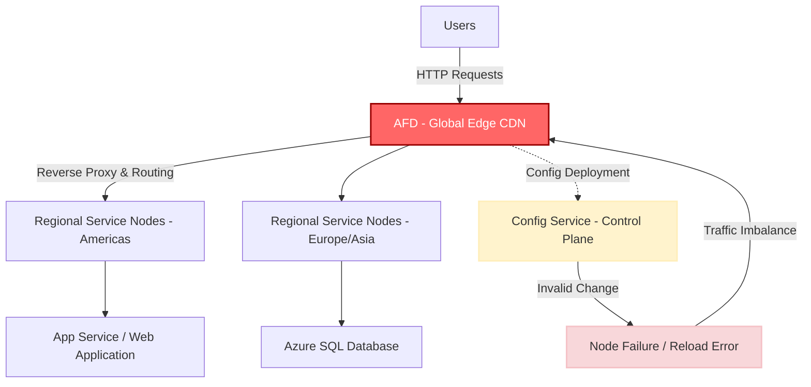

# Microsoft Azure Front Door Outage

<Info>
**Incident Date:** October 29-30, 2025  
**Duration:** ~8 hours 20 minutes  
**Root Cause:** Invalid configuration rollout in Azure Front Door  
**Scope:** Global across all Azure regions
</Info>

## Overview

Between **15:45 UTC on October 29** and **00:05 UTC on October 30, 2025**, Microsoft Azure experienced a widespread service disruption caused by an invalid configuration rollout in **Azure Front Door (AFD)** — Azure's global **Application Delivery Network / CDN / Layer 7 load balancer**.

<Warning>
The incident disrupted customer applications and Microsoft-hosted services worldwide, including authentication, data platforms, and management portals. External organizations like Heathrow Airport, Alaska Airlines, Starbucks, Costco, Vodafone UK, and the Scottish Parliament were significantly impacted.
</Warning>

The root cause was a software defect in the deployment pipeline that allowed a faulty configuration to bypass validation safeguards, propagating globally and causing AFD nodes to fail.

## Root Cause Analysis

### Primary Technical Cause

An **inadvertent tenant-level configuration change** triggered an **invalid state across AFD nodes**, causing them to fail to load properly.

<Steps>
  <Step title="Configuration Change Initiated">
    A tenant-level configuration change was made to Azure Front Door, likely intended as a routine update.
  </Step>
  
  <Step title="Validation Bypass">
    A software defect in the deployment pipeline allowed the faulty configuration to **bypass validation safeguards** that should have caught the error.
  </Step>
  
  <Step title="Global Propagation">
    The invalid configuration propagated globally across AFD's edge node fleet before the error was detected.
  </Step>
  
  <Step title="Node Failures">
    AFD nodes attempted to load the malformed configuration, failed, and dropped out of the healthy node pool.
  </Step>
  
  <Step title="Cascading Overload">
    As unhealthy nodes dropped, traffic was re-routed to the reduced pool of healthy nodes, causing overload, cascading timeouts, and connection errors.
  </Step>
</Steps>

### Why the Defect Went Undetected

<Accordion title="Insufficient Pre-Deployment Validation">
  - Configuration schema validation was incomplete
  - Edge cases in tenant-level configs not covered by tests
  - No syntax checking for the specific configuration parameter that failed
  - Automated tests didn't catch the invalid state
</Accordion>

<Accordion title="Lack of Canary Deployment">
  - Configuration changes deployed globally, not to a canary subset first
  - No gradual rollout to detect issues early
  - Missing "blast radius" controls for global configuration changes
</Accordion>

<Accordion title="Limited Runtime Validation">
  - Nodes didn't perform sanity checks before applying configuration
  - No graceful fallback to previous known-good configuration
  - Missing circuit breakers to halt propagation on error detection
</Accordion>

### Mitigation Actions

Microsoft's engineering team took the following recovery steps:



1. **Blocked new configuration changes** to prevent further propagation
2. **Deployed the "last known good" configuration** globally
3. **Gradually reloaded AFD nodes** with the corrected configuration
4. **Rebalanced traffic** to restore full scale and capacity
5. **Failed over Azure Portal** to alternate endpoints to restore management access

## Timeline

<Note>
All times are in UTC (Coordinated Universal Time)
</Note>

| Time (UTC) | Event |
|:-----------|:------|
| **15:45** | Customer impact begins (latency, timeouts, connection errors) |
| **16:04** | Internal monitoring alerts trigger incident investigation |
| **16:18** | Public update posted to Azure Status page |
| **16:20** | Targeted Service Health notifications sent to affected customers |
| **17:26** | Azure Portal failed away from AFD to alternate endpoints |
| **17:30** | **Mitigation:** Blocked all new AFD configuration changes |
| **17:40** | **Mitigation:** Initiated deployment of "last known good" configuration |
| **18:30** | Fixed configuration pushed globally to all regions |
| **18:45** | Node recovery begins; gradual routing to healthy nodes |
| **23:15** | PowerApps dependency mitigated; customers confirm recovery |
| **00:05 (Oct 30)** | **Full mitigation confirmed**; AFD impact resolved |

<Tip>
Notice the ~2 hour gap between detecting the issue (16:04) and applying the mitigation (17:30). This highlights the complexity of diagnosing global infrastructure failures and the need for automated rollback mechanisms.
</Tip>

## Impact Assessment

### Global Scope

- **Duration:** ≈ 8 hours 20 minutes
- **Severity:** 🔴 Critical
- **Geographic Scope:** 
  - Americas
  - Europe
  - Asia Pacific
  - Middle East & Africa
  - Azure Government
  - Azure China
  - Azure Jio (India)

### Affected Azure Services

<Tabs>
  <Tab title="Identity & Access">
    **Azure AD B2C / Entra ID**
    - Mobility Management Policy
    - Identity and Access Management (IAM)
    - User authentication flows
    - B2C custom policy execution
    
    <Warning>
    Authentication failures prevented users from accessing their applications, creating a complete service outage for many customers.
    </Warning>
  </Tab>
  
  <Tab title="Application & Data">
    **Affected Services:**
    - Azure App Service
    - Azure SQL Database
    - Azure Databricks
    - Azure Container Registry
    - Azure Functions
    - Azure Logic Apps
    
    **Impact:**
    - Application frontends unreachable
    - Database connection timeouts
    - Container image pulls failed
    - Serverless function cold starts blocked
  </Tab>
  
  <Tab title="Security">
    **Affected Services:**
    - Microsoft Defender EASM
    - Microsoft Copilot for Security
    - Microsoft Sentinel (Threat Intelligence)
    - Azure Security Center
    
    **Impact:**
    - Security monitoring gaps
    - Threat intelligence updates delayed
    - Incident response tools unavailable
  </Tab>
  
  <Tab title="Platform & Management">
    **Affected Services:**
    - Azure Portal (management interface)
    - Azure Virtual Desktop
    - Microsoft Purview
    - Azure Media Services
    - Azure Video Indexer
    
    **Impact:**
    - Administrators couldn't manage resources
    - Remote desktop access failed
    - Media streaming interrupted
  </Tab>
</Tabs>

### External Organizations Impacted

<CardGroup cols={2}>
  <Card title="Transportation" icon="plane">
    **Heathrow Airport**
    - Flight information displays
    - Check-in systems
    
    **Alaska Airlines**
    - Booking systems
    - Mobile app access
  </Card>
  
  <Card title="Retail & Hospitality" icon="store">
    **Starbucks**
    - Mobile ordering
    - Loyalty app
    
    **Costco**
    - E-commerce platform
    - Warehouse systems integration
  </Card>
  
  <Card title="Telecommunications" icon="tower-cell">
    **Vodafone UK**
    - Customer portal
    - Account management
    - Mobile app services
  </Card>
  
  <Card title="Government" icon="landmark">
    **Scottish Parliament**
    - Electronic voting system suspended
    - Parliamentary business delayed
    - Committee meetings postponed
  </Card>
</CardGroup>

## Contributing Factors

### Validation Bypass Defect

<Warning>
**Root Issue:** A software defect allowed bad configuration to skip safety checks.
</Warning>

The deployment pipeline should have included:
- Schema validation
- Syntax checking
- Semantic analysis
- Integration testing
- Canary deployment

The defect bypassed one or more of these safeguards.

### Global Blast Radius



AFD's central role as a **global entry point** created a logical single point of failure:
- Single control plane for all regions
- Configuration changes affect entire fleet
- No regional isolation for faulty configs
- Cascading failure across all geographies

### Load Imbalance

As unhealthy nodes dropped out, remaining healthy nodes experienced:
- **Traffic concentration** - sudden increase in requests per node
- **Resource exhaustion** - CPU, memory, connection limits hit
- **Cascading timeouts** - slow responses causing more retries
- **Connection pool saturation** - backend connections maxed out

### Configuration Propagation Speed

<Note>
Changes replicated to the global fleet **before** errors were detected, highlighting the need for gradual rollout mechanisms.
</Note>

Ideal propagation strategy:
1. Deploy to canary nodes (1-5% of fleet)
2. Monitor for 15-30 minutes
3. Automatically rollback if errors detected
4. Gradually increase to 10%, 25%, 50%, 100%
5. Halt at any stage if anomalies occur

### Recovery Complexity

Phased reload was required to avoid further instability:
- Reloading all nodes simultaneously could cause traffic spikes
- Gradual rebalancing needed to prevent secondary failures
- Dependent services (PowerApps) recovered at different rates
- Cached configuration needed time to expire

## Lessons Learned

### For DevOps Teams

<Steps>
  <Step title="Strengthen CI/CD Guardrails">
    Enforce automated validation for all configuration changes:
    
    ```yaml
    # Example Azure DevOps pipeline
    stages:
      - stage: Validate
        jobs:
          - job: SchemaValidation
            steps:
              - task: ValidateConfig@1
                inputs:
                  configFile: 'frontdoor-config.json'
                  schema: 'config-schema.json'
          
          - job: SyntaxCheck
            steps:
              - script: |
                  python validate_config.py --strict
          
          - job: SemanticAnalysis
            steps:
              - task: ConfigAnalyzer@1
                inputs:
                  checkDuplicates: true
                  checkLimits: true
      
      - stage: CanaryDeploy
        dependsOn: Validate
        jobs:
          - deployment: DeployToCanary
            environment: 'AFD-Canary'
            strategy:
              runOnce:
                deploy:
                  steps:
                    - task: DeployConfig@1
                      inputs:
                        targetNodes: 'canary-fleet'
                        rollbackOnError: true
    ```
  </Step>
  
  <Step title="Implement Canary Deployments">
    Deploy global configuration changes gradually:
    - Start with 1-5% of fleet (canary nodes)
    - Monitor error rates, latency, and health checks
    - Automatically rollback if anomalies detected
    - Gradually increase percentage over time
    
    <Tip>
    Use feature flags to control rollout even more granularly, enabling instant rollback without redeployment.
    </Tip>
  </Step>
  
  <Step title="Automate Rollback Mechanisms">
    Implement automatic rollback on anomaly detection:
    - Monitor config load success rate
    - Track node health before/after config change
    - Detect error rate increases
    - Trigger automatic rollback to last known good
    
    ```python
    # Example health check monitoring
    def monitor_config_deployment(deployment_id):
        baseline_error_rate = get_baseline_error_rate()
        
        for minute in range(15):  # Monitor for 15 minutes
            current_error_rate = get_current_error_rate()
            
            if current_error_rate > baseline_error_rate * 1.5:
                trigger_rollback(deployment_id)
                alert_oncall("Config rollback triggered")
                return False
        
        return True  # Deployment successful
    ```
  </Step>
  
  <Step title="Reduce Blast Radius">
    Segment edge fleets to contain faulty rollouts:
    - Logical tenancy isolation
    - Regional deployment groups
    - Customer tier separation (enterprise vs. standard)
    - Progressive rollout rings
  </Step>
</Steps>

### For DevSecOps Teams

<Accordion title="Enforce Change Control Governance">
  **Policy Requirements:**
  - Multi-stage approval for global configuration changes
  - Peer review for infrastructure-as-code
  - Automated compliance checking
  - Change advisory board for high-risk changes
  
  **Implementation:**
  ```yaml
  # Example change control policy
  globalConfigChanges:
    requireApprovals: true
    minimumApprovers: 2
    requiredReviewers:
      - sre-team
      - security-team
    automaticRollbackEnabled: true
    maxBlastRadius: 5%  # Canary percentage
    monitoringPeriod: 30m
  ```
</Accordion>

<Accordion title="Implement Security Awareness Training">
  Major outages increase phishing risks:
  - Users more likely to click suspicious "service restoration" emails
  - Attackers impersonate support teams
  - Fake password reset campaigns
  
  **Defensive Actions:**
  - Send official communications through verified channels
  - Warn users about phishing attempts
  - Monitor for domain spoofing
  - Provide clear guidance on legitimate support contacts
</Accordion>

<Accordion title="Deploy Real-Time Observability">
  Monitor configuration state loads with:
  - Health probes before and after config changes
  - Synthetic monitors testing critical paths
  - Error rate tracking by node and region
  - Configuration version tracking
  
  ```python
  # Example synthetic monitor
  def synthetic_monitor_afd():
      endpoints = get_all_afd_endpoints()
      results = []
      
      for endpoint in endpoints:
          try:
              response = requests.get(endpoint, timeout=5)
              results.append({
                  'endpoint': endpoint,
                  'status': response.status_code,
                  'latency': response.elapsed.total_seconds()
              })
          except Exception as e:
              results.append({
                  'endpoint': endpoint,
                  'status': 'error',
                  'error': str(e)
              })
      
      return results
  ```
</Accordion>

### For SRE Teams

<Tabs>
  <Tab title="Incident Readiness">
    **Maintain Origin Failover Paths**
    
    Ensure services can route around AFD failures:
    - Azure Traffic Manager for DNS-level failover
    - Direct origin access for emergency bypass
    - Alternate CDN provider as backup
    - Static failover pages for critical info
    
    **Architecture Example:**
    ```mermaid
    flowchart LR
        Users["Users"] --> TM["Traffic Manager"]
        TM --> AFD["Azure Front Door\n(Primary)"]
        TM -.-> Origin["Direct Origin\n(Failover)"]
        AFD --> Backend["Backend Services"]
        Origin --> Backend
        
        style AFD fill:#d4edda,stroke:#c3e6cb
        style Origin fill:#fff3cd,stroke:#ffeeba
    ```
  </Tab>
  
  <Tab title="Configuration Management">
    **Version Control All Configurations**
    
    Treat configuration as code:
    - Store in Git with full history
    - Require pull requests for changes
    - Tag releases (config-v1.2.3)
    - Maintain rollback scripts
    
    **Example Git Workflow:**
    ```bash
    # Create feature branch for config change
    git checkout -b config/update-afd-rules
    
    # Make changes
    vim azure-frontdoor-config.json
    
    # Commit with descriptive message
    git commit -m "Add rate limiting rules for API endpoints"
    
    # Push and create pull request
    git push origin config/update-afd-rules
    
    # After approval and deployment
    git tag config-v2.1.0
    git push origin config-v2.1.0
    ```
  </Tab>
  
  <Tab title="Blast Radius Control">
    **Segment Infrastructure**
    
    Reduce failure impact through segmentation:
    - Deploy separate AFD instances for critical vs. non-critical
    - Use different configuration management for each
    - Isolate customer tiers (enterprise, standard, free)
    - Implement regional independence where possible
    
    <Warning>
    Never let a single configuration change affect your entire global infrastructure simultaneously.
    </Warning>
  </Tab>
</Tabs>

## Architecture Diagram

### Failure Flow



## Key Takeaways

<CardGroup cols={2}>
  <Card title="Validation is Critical" icon="shield-check">
    Configuration changes must pass rigorous validation before global deployment. A single bypass can cause catastrophic failure.
  </Card>
  
  <Card title="Canary Deployments Save Lives" icon="bird">
    Gradual rollouts with automatic rollback prevent global outages from configuration errors.
  </Card>
  
  <Card title="Blast Radius Matters" icon="bullseye">
    Global infrastructure changes should never affect 100% of fleet simultaneously. Segment and contain.
  </Card>
  
  <Card title="Observability Enables Recovery" icon="chart-line">
    Real-time monitoring of config changes enables fast detection and rollback of failures.
  </Card>
</CardGroup>

---

## References

- [Azure Status History](https://azure.status.microsoft/en-gb/status/history/)
- [Reuters Coverage](https://www.reuters.com/technology/microsoft-azure-down-thousands-users-downdetector-shows-2025-10-29/)
- [The Independent Coverage](https://www.independent.co.uk/news/world/americas/aws-outage-amazon-microsoft-down-live-updates-b2854714.html)

<Note>
**Disclaimer:** This case study is for educational and analytical purposes. All information is based on publicly available sources and official Microsoft communications.

**Author:** Zepher Ashe  
**License:** CC BY-NC-SA 4.0  
**Last Updated:** November 21, 2025
</Note>