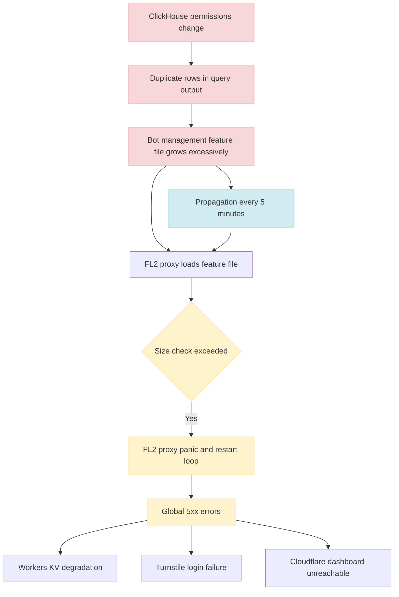
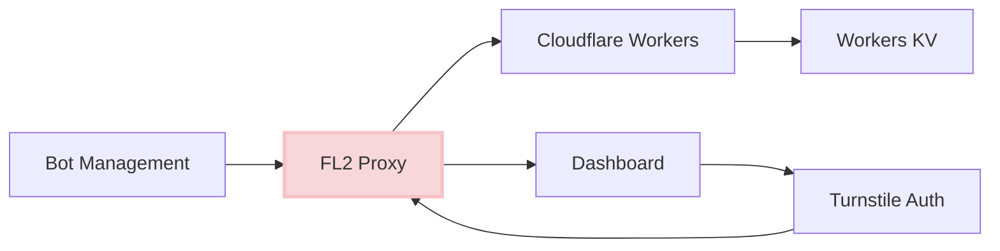

# Cloudflare Global Outage

<Info>
**Incident Date:** November 18, 2025  
**Duration:** ~6 hours  
**Root Cause:** Malformed bot-management configuration file  
**Scope:** Global, affecting millions of websites
</Info>

## Overview

On **November 18, 2025**, Cloudflare experienced its most severe global outage since 2019. A malformed, auto-generated configuration file caused Cloudflare's new Rust-based **FL2 proxy** to **panic**, resulting in global **5xx Internal Server Errors** across millions of domains.

<Warning>
High-impact services including ChatGPT, X (Twitter), crypto platforms, and numerous SaaS APIs degraded or failed completely. The outage also affected Cloudflare's internal infrastructure, including the Dashboard, Workers KV, and Turnstile authentication, significantly slowing remediation efforts.
</Warning>

This incident highlights the catastrophic impact that configuration management failures can have on global internet infrastructure, and demonstrates how tightly coupled systems can amplify single points of failure.

## Root Cause Analysis

### Primary Technical Cause

A **ClickHouse permissions update** unintentionally allowed duplicate rows to appear in a query used to generate Cloudflare's **Bot Management feature file**.

<Steps>
  <Step title="Permission Change">
    A ClickHouse database permissions update was made, likely for routine access control purposes. This change was classified as low-risk internal work.
  </Step>
  
  <Step title="Duplicate Data Introduced">
    The permission change inadvertently allowed a query to return duplicate rows. The query was used to generate the bot-management feature file.
  </Step>
  
  <Step title="File Size Exceeded Limit">
    The bot-management feature file normally contained &lt;200 features. Duplicated entries **doubled** the file size, exceeding a **hard-coded limit** in the FL2 proxy.
  </Step>
  
  <Step title="Proxy Panic">
    When FL2 attempted to load the oversized file:
    - The proxy encountered an unexpected state
    - A `Result::unwrap()` call on an `Err` variant caused a **panic**
    - Proxies entered a restart loop, unable to serve traffic
  </Step>
  
  <Step title="Global Propagation">
    The malformed file propagated **every ~5 minutes** to edge nodes globally, causing widespread instability as nodes received different configuration versions.
  </Step>
</Steps>

### The Technical Details

<Accordion title="Why Result::unwrap() Failed">
  In Rust, `Result<T, E>` represents either success (`Ok(T)`) or failure (`Err(E)`). The `.unwrap()` method extracts the success value but **panics** if called on an error.
  
  ```rust
  // Simplified illustration
  fn load_bot_features(file: &str) -> Result<BotFeatures, ConfigError> {
      let features = parse_config(file)?;
      
      // Hard-coded assumption: features.len() <= 200
      if features.len() > 200 {
          return Err(ConfigError::TooManyFeatures);
      }
      
      Ok(features)
  }
  
  // Somewhere in the proxy code:
  let bot_features = load_bot_features(config_file).unwrap();  // PANIC!
  ```
  
  <Warning>
  Using `.unwrap()` in production code is dangerous. The proxy should have used graceful error handling like `.unwrap_or_else()` or pattern matching.
  </Warning>
</Accordion>

<Accordion title="Why Duplicates Weren't Detected">
  The bot-management pipeline lacked several critical safeguards:
  - No schema validation on the generated file
  - No duplicate detection in the query results
  - No file size monitoring or alerting
  - No checksum verification before propagation
  - No pre-deployment validation gates
  
  The system assumed the data would always be well-formed.
</Accordion>

<Accordion title="Propagation Mechanism">
  Configuration files propagated to edge nodes on a fixed schedule:
  - **Interval:** Every ~5 minutes
  - **No validation:** Files pushed without runtime verification
  - **No canary:** All nodes received updates simultaneously
  - **Mixed state:** Some nodes had good config, others had bad
  
  This created a global "configuration lottery" where user requests succeeded or failed based on which edge node they hit.
</Accordion>

### Why It Cascaded Globally



The outage cascaded because:

1. **Over-coupled components:** Bot-management → proxy → Workers → Dashboard formed a single failure domain
2. **Automated propagation:** Bad config spread before detection
3. **Internal tool dependency:** Engineers couldn't access Dashboard (needed Turnstile, which was behind failing proxies)
4. **No graceful degradation:** Proxy panic caused complete failure, not reduced functionality

## Timeline

<Note>
All times are in UTC (Coordinated Universal Time)
</Note>

| Time | Event |
|:-----|:------|
| **11:05** | ClickHouse permissions changed → duplicates introduced in query |
| **11:28** | Initial global 5xx errors detected across edge network |
| **11:32** | Error rate escalates; monitoring systems trigger alerts |
| **12:00** | Outage severity increases; bot-management file continues propagation |
| **13:05** | Cloudflare applies initial mitigations (bypass Workers KV & Access) |
| **14:24** | Configuration propagation halted; investigation continues |
| **14:30** | Known-good configuration identified and deployment begins |
| **17:06** | **Full global restoration declared** |

<Tip>
The ~4 hour gap between halting propagation (14:24) and full restoration (17:06) shows how complex distributed system recovery can be. Every edge node needed to reload configuration and stabilize.
</Tip>

## Impact Assessment

### Global Internet Impact

<Warning>
**Millions of websites returned 500 Internal Server Errors**, affecting a significant portion of global internet traffic.
</Warning>

#### High-Profile Services Affected

<CardGroup cols={2}>
  <Card title="AI & Social Media" icon="comments">
    **ChatGPT** (OpenAI)
    - Chat interface unavailable
    - API requests failing
    
    **X (Twitter)**
    - Timeline loading errors
    - Image/video upload failures
  </Card>
  
  <Card title="Cryptocurrency" icon="bitcoin-sign">
    **Multiple Exchanges**
    - Trading interfaces down
    - Price data unavailable
    - Deposit/withdrawal blocked
  </Card>
  
  <Card title="SaaS Platforms" icon="cloud">
    **Business Applications**
    - CRM systems
    - Collaboration tools
    - Project management
    - Customer support portals
  </Card>
  
  <Card title="Mobile Applications" icon="mobile-screen">
    **API-Dependent Apps**
    - News aggregators
    - Gaming platforms
    - Social media clients
    - Content delivery
  </Card>
</CardGroup>

### Cloudflare Internal Impact

<Accordion title="Dashboard Login Failed">
  The Cloudflare Dashboard authentication relies on **Turnstile** (Cloudflare's CAPTCHA replacement), which sits behind the same FL2 proxy layer that was failing.
  
  **Impact:**
  - Engineers couldn't log in to management interface
  - Configuration changes had to be made through alternate paths
  - Internal tooling access significantly delayed
  - Coordination difficulties during incident response
</Accordion>

<Accordion title="Workers KV Unavailable">
  Cloudflare Workers KV (key-value storage) was also affected:
  - Workers using KV for data storage failed
  - Internal tools relying on Workers KV degraded
  - Customer serverless applications experienced errors
</Accordion>

<Accordion title="Mixed Configuration States">
  Different edge nodes had different configuration versions:
  - Some nodes had the "good" file
  - Others had the faulty one
  - User experience varied by edge location
  - Debugging complicated by inconsistent state
  - Rollback required careful sequencing
</Accordion>

## Contributing Factors

### Hard-Coded Feature Limit

<Warning>
A strict, unvalidated assumption ("≤200 features") led to runtime panic instead of graceful degradation.
</Warning>

**Better Approach:**
```rust
// Instead of unwrap() which panics:
let bot_features = load_bot_features(config_file).unwrap();

// Use graceful error handling:
let bot_features = match load_bot_features(config_file) {
    Ok(features) => features,
    Err(e) => {
        log::error!("Failed to load bot features: {}", e);
        // Use cached version or safe defaults
        get_cached_bot_features().unwrap_or_default()
    }
};
```

### Lack of Configuration Validation

The feature file generation pipeline had no:
- **Size limits:** No monitoring of file growth
- **Duplicate detection:** Duplicate entries not flagged
- **Schema validation:** No enforcement of expected structure
- **Checksum verification:** No integrity checks before deployment
- **Pre-deployment testing:** No staging environment validation

### Automated, Timed Propagation

<Tabs>
  <Tab title="Current (Problematic)">
    **Fixed-Schedule Propagation**
    
    - Every 5 minutes, automatically push new config
    - No validation before propagation
    - All nodes receive update simultaneously
    - No rollback mechanism
    
    ```python
    # Simplified illustration of problematic approach
    while True:
        config = generate_bot_config()  # No validation!
        push_to_all_nodes(config)       # No canary!
        time.sleep(300)                 # 5 minutes
    ```
  </Tab>
  
  <Tab title="Recommended">
    **Validated Canary Deployment**
    
    - Generate config and validate before any deployment
    - Deploy to canary nodes (1-5% of fleet)
    - Monitor for errors for 10-15 minutes
    - Auto-rollback if anomalies detected
    - Gradually expand to 10%, 25%, 50%, 100%
    
    ```python
    # Better approach with validation and canary
    def deploy_config(config):
        # Validate before deployment
        if not validate_config(config):
            alert("Config validation failed")
            return False
        
        # Canary deployment
        canary_nodes = get_canary_fleet(percentage=5)
        deploy_to_nodes(canary_nodes, config)
        
        # Monitor canary
        if not monitor_health(canary_nodes, duration=600):
            rollback(canary_nodes)
            alert("Canary failed, rollback triggered")
            return False
        
        # Gradual rollout
        for percentage in [10, 25, 50, 100]:
            nodes = get_fleet(percentage)
            deploy_to_nodes(nodes, config)
            if not monitor_health(nodes, duration=300):
                rollback_all()
                return False
        
        return True
    ```
  </Tab>
</Tabs>

### Over-Coupled System Components

Bot-management → proxy → Workers → Dashboard formed a single blast radius:



<Note>
Notice the circular dependency: Dashboard → Turnstile → Proxy. When Proxy failed, engineers couldn't access Dashboard to fix the issue.
</Note>

**Decoupling Strategy:**
- Provide alternate access path to Dashboard (direct origin, VPN)
- Don't put internal tooling behind the same infrastructure as customer traffic
- Implement circuit breakers to prevent cascading failures
- Design for graceful degradation (disable bot-management if config fails)

### Internal Change Misclassified as Low-Risk

<Warning>
Typical organizational oversight: "internal change = safe"

This incident disproves that assumption.
</Warning>

The ClickHouse permissions change was likely:
- Classified as low-risk routine maintenance
- Not subject to full change control process
- Not tested in staging environment
- Approved quickly without deep review

**Lesson:** Infrastructure changes, even "internal" ones, can have cascading effects. All changes need proper risk assessment.

## Mitigation & Recovery Actions

### Cloudflare's Response

<Steps>
  <Step title="Halt Propagation">
    First priority: stop the bad configuration from spreading further
    - Disabled automatic config propagation
    - Prevented new updates from reaching edge nodes
    - Bought time for investigation
  </Step>
  
  <Step title="Identify Good Configuration">
    Located the last known good feature file
    - Reviewed configuration history
    - Identified version before duplicates
    - Validated file integrity
  </Step>
  
  <Step title="Deploy Known-Good Configuration">
    Pushed corrected configuration globally
    - Used emergency deployment process
    - Bypassed normal propagation schedule
    - Prioritized critical edge locations
  </Step>
  
  <Step title="Bypass Failing Components">
    Temporarily disabled dependencies to restore access
    - Bypassed Workers KV for internal tools
    - Created alternate Dashboard access path
    - Enabled emergency authentication bypass
  </Step>
  
  <Step title="Restart Proxy Fleet">
    Restarted FL2 proxies with verified configuration
    - Sequenced restarts to prevent traffic spikes
    - Monitored error rates during restart
    - Verified health checks passing
  </Step>
  
  <Step title="Validate Recovery">
    Systematically verified each edge node
    - Checked configuration version
    - Validated health metrics
    - Confirmed customer traffic recovering
    - Monitored for residual issues
  </Step>
</Steps>

### Residual Behavior

- **Latency fluctuations** persisted briefly as caches warmed up
- **Dependent services** recovered at different speeds based on node propagation order
- Some **DNS caches** held stale failure information temporarily
- **Customer applications** needed to retry failed requests

## Lessons Learned

### 1. Treat All Config Surfaces as High-Risk

<Warning>
Auto-generated configurations are just as dangerous as manually written ones. Possibly more so, since they lack human review.
</Warning>

**Requirements for Configuration Systems:**

<CardGroup cols={2}>
  <Card title="Schema Validation" icon="check-double">
    - Define strict schemas for all configs
    - Validate before generation
    - Enforce data types and constraints
    - Reject invalid configurations
  </Card>
  
  <Card title="Size Limits" icon="ruler">
    - Monitor file sizes
    - Alert on unexpected growth
    - Enforce maximum limits
    - Track historical trends
  </Card>
  
  <Card title="Duplication Detection" icon="copy">
    - Check for duplicate entries
    - Validate query result uniqueness
    - Alert on data anomalies
    - Log generation statistics
  </Card>
  
  <Card title="Checksums" icon="fingerprint">
    - Generate checksums for all configs
    - Verify integrity before deployment
    - Compare against expected values
    - Track checksum history
  </Card>
</CardGroup>

**Implementation Example:**

```python
class BotFeatureConfig:
    MAX_FEATURES = 250  # Allow headroom above expected 200
    MAX_FILE_SIZE = 10 * 1024 * 1024  # 10 MB
    
    def generate(self) -> Optional[str]:
        # Query database
        features = self.query_bot_features()
        
        # Validate: no duplicates
        if len(features) != len(set(f['id'] for f in features)):
            log.error("Duplicate features detected!")
            return None
        
        # Validate: within limits
        if len(features) > self.MAX_FEATURES:
            log.error(f"Too many features: {len(features)}")
            return None
        
        # Generate config file
        config = self.serialize(features)
        
        # Validate: size check
        if len(config) > self.MAX_FILE_SIZE:
            log.error(f"Config too large: {len(config)} bytes")
            return None
        
        # Generate checksum
        checksum = hashlib.sha256(config.encode()).hexdigest()
        log.info(f"Generated config: {len(features)} features, checksum {checksum}")
        
        return config
```

### 2. Fallback Paths Prevent Catastrophic Failure

A bot-management failure should **degrade service**, not **collapse core traffic**.

<Accordion title="Graceful Degradation Pattern">
  ```rust
  fn serve_request(req: Request) -> Response {
      // Try to apply bot management
      let bot_decision = match apply_bot_management(&req) {
          Ok(decision) => decision,
          Err(e) => {
              // Log error but don't fail the request
              log::warn!("Bot management failed: {}, allowing request", e);
              BotDecision::Allow  // Safe default
          }
      };
      
      if bot_decision == BotDecision::Block {
          return Response::forbidden();
      }
      
      // Continue serving the request
      proxy_to_origin(&req)
  }
  ```
  
  Key principles:
  - Never panic on config errors
  - Always have safe defaults
  - Log errors for investigation
  - Degrade functionality, don't fail completely
</Accordion>

### 3. Propagation Must Be Controlled and Observable

<Steps>
  <Step title="Canary Nodes">
    Deploy to small subset first:
    - 1-5% of fleet initially
    - Geographically diverse
    - Mix of high and low traffic nodes
    - Isolated from production critical paths
  </Step>
  
  <Step title="Validation Gates">
    Automatic quality checks:
    - Error rate within baseline ±10%
    - Latency P95 not increased >20%
    - No proxy panics or restarts
    - Health checks passing
  </Step>
  
  <Step title="Automatic Rollback">
    Trigger rollback if:
    - Error rate exceeds threshold
    - Proxy restart loop detected
    - Health checks fail
    - Manual emergency stop
  </Step>
  
  <Step title="Propagation Metrics">
    Monitor and alert on:
    - Config version distribution
    - Deployment progress percentage
    - Node health by config version
    - Rollback frequency
  </Step>
</Steps>

### 4. Monitor Assumptions—Not Just Metrics

<Warning>
Monitoring CPU, memory, and request rate isn't enough. Monitor your architectural assumptions.
</Warning>

**Alert On:**

<CardGroup cols={2}>
  <Card title="File Size Anomalies" icon="file-zipper">
    ```python
    if current_size > baseline_size * 1.5:
        alert("Config file size anomaly")
    ```
  </Card>
  
  <Card title="Duplicate Feature Count" icon="clone">
    ```python
    if len(features) != len(set(features)):
        alert("Duplicate features detected")
    ```
  </Card>
  
  <Card title="Proxy Panic Loops" icon="rotate">
    ```python
    if restart_count > 3 in last_5_minutes:
        alert("Proxy restart loop detected")
    ```
  </Card>
  
  <Card title="Blast Radius Changes" icon="burst">
    ```python
    affected_nodes = count_failing_nodes()
    if affected_nodes > total_nodes * 0.1:
        alert("Widespread failure detected")
    ```
  </Card>
</CardGroup>

### 5. Internal Changes Need Staging and Risk Assessment

<Note>
Security and metadata changes can create unintended side effects. The ClickHouse permissions change was "internal" but had global customer impact.
</Note>

**Risk Assessment Framework:**

| Change Type | Risk Level | Required Actions |
|:------------|:-----------|:-----------------|
| Database permissions | 🟡 Medium | Staging test, query impact analysis |
| Schema changes | 🔴 High | Full regression testing, rollback plan |
| Config generation logic | 🔴 High | Canary deployment, monitoring |
| Proxy code changes | 🔴 Critical | Multi-stage rollout, feature flags |

### 6. Access Paths Must Survive Outages

<Warning>
**Critical Principle:** Engineering access should not rely on the same components under failure.
</Warning>

**Solutions:**

<Tabs>
  <Tab title="Alternate Access Paths">
    - Direct origin access (bypass CDN)
    - VPN to internal management network
    - Out-of-band management interfaces
    - SSH/console access to core systems
  </Tab>
  
  <Tab title="Emergency Bypass">
    - Feature flags to disable authentication
    - Emergency admin credentials
    - Break-glass procedures
    - Documented escalation paths
  </Tab>
  
  <Tab title="Tooling Independence">
    - Internal tools on separate infrastructure
    - Management dashboards on different stack
    - Monitoring systems fully independent
    - Incident response tools always available
  </Tab>
</Tabs>

## Key Takeaways

<CardGroup cols={2}>
  <Card title="Configuration is Code" icon="code">
    Treat all configuration with the same rigor as application code: version control, testing, validation, and gradual rollout.
  </Card>
  
  <Card title="Graceful Degradation" icon="shield-halved">
    Systems should degrade gracefully, not fail catastrophically. A bot-management error shouldn't bring down the entire proxy.
  </Card>
  
  <Card title="Decoupling is Critical" icon="link-slash">
    Avoid circular dependencies between infrastructure components. Engineers must be able to access tools during outages.
  </Card>
  
  <Card title="Internal Changes are Risky" icon="triangle-exclamation">
    "Internal" changes can have external impact. Database permissions, schema changes, and metadata updates need full change control.
  </Card>
</CardGroup>

---

## References

- [Official Cloudflare Post-Mortem](https://blog.cloudflare.com/18-november-2025-outage/)

<Note>
**Disclaimer:** This case study is for educational and analytical purposes. All information is based on publicly available sources and official Cloudflare communications.

**Author:** Zepher Ashe  
**License:** CC BY-NC-SA 4.0  
**Last Updated:** November 21, 2025
</Note>